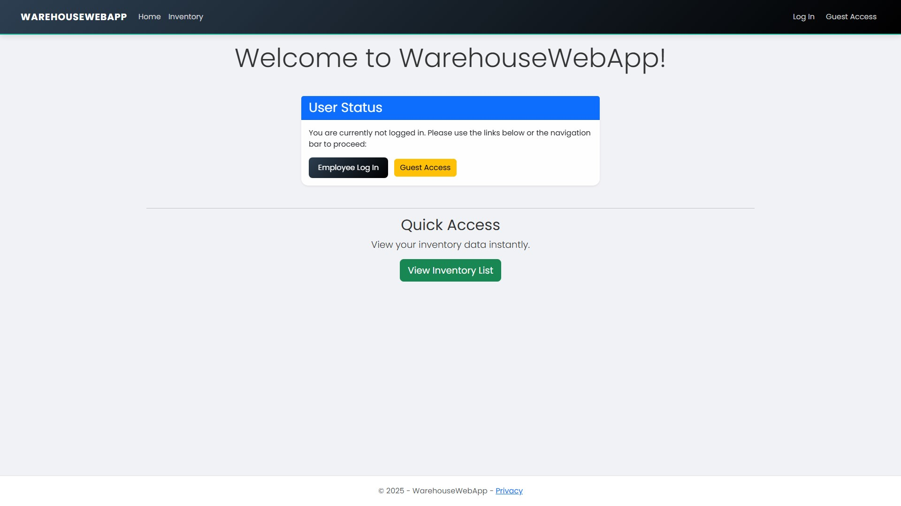
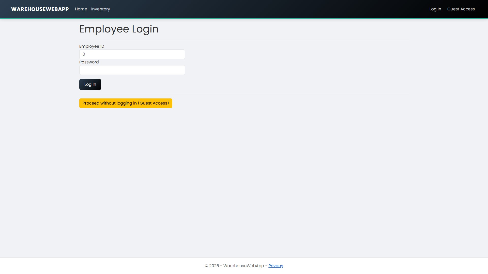
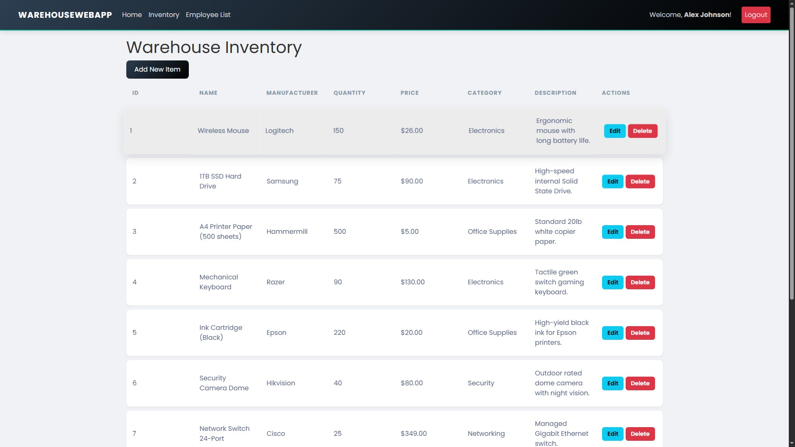
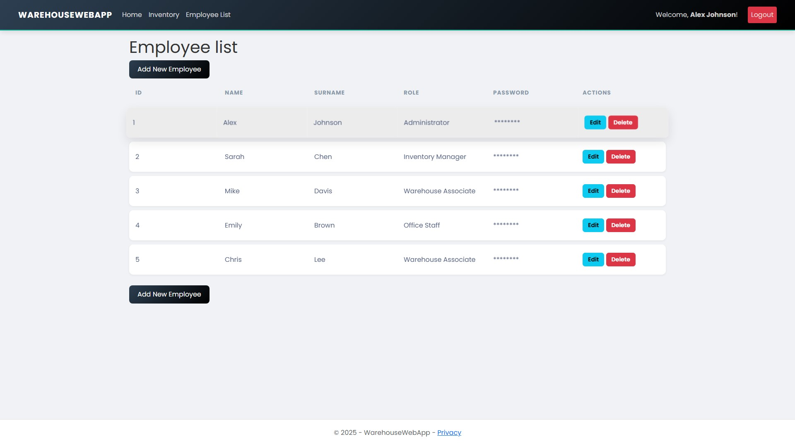
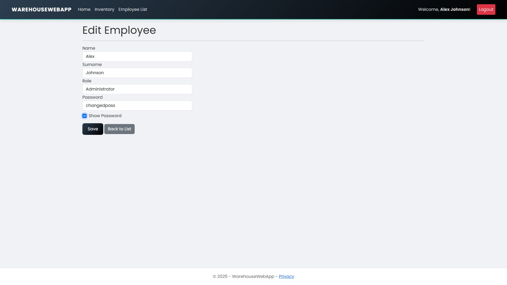
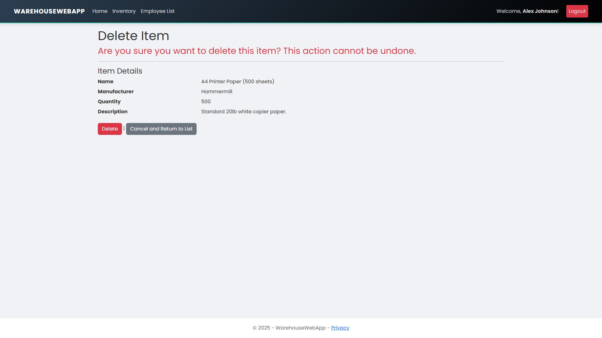

# WarehouseWebApp

A secure three tier Web application built with ASP.NET Core MVC for managing warehouse stock and employee access.

## System Preview

| Home / Welcome | Login Page |
| :---: | :---: |
|  |  |

| Inventory List | Employee Management |
| :---: | :---: |
|  |  |

| Edit Records | Delete Confirmation |
| :---: | :---: |
|  |  |

## Architecture

The project follows a **Three Tier Architecture** to ensure a professional separation of concerns:

* **Presentation Layer (MVC):** Manages the User Interface, Controllers, and Middleware.
* **Business Layer:** Processes logic, validates data, and acts as a bridge between the UI and Data layers.
* **Data Layer:** Handles raw SQL communication using ADO.NET and defines Data Models.


---

## Technical Stack

* **Backend:** ASP.NET Core
* **Database:** SQL Server (ADO.NET / Microsoft.Data.SqlClient)
* **Authentication:** Cookie based Authentication with Role Based Access Control (RBAC)
* **Frontend:** Razor Pages, Bootstrap, CSS, and JavaScript.

---

## File Map

### DataLayer
* **Models/**: `Item.cs`, `Employee.cs` (Includes Data Annotations for server side validation).
* **Repositories/**: `ItemRepository.cs`, `EmployeeRepository.cs` (Contains SQL queries and Command logic).
* **Interfaces**: `IItemRepository.cs`, `IEmployeeRepository.cs`.

### BusinessLayer
* **ItemBusiness.cs**: Handles inventory CRUD logic and data type conversions.
* **EmployeeBusiness.cs**: Manages employee validation, credentials, and password security logic.

### PresentationLayer
* **Controllers/**: `InventoryController.cs`, `AuthController.cs`, `EmployeeController.cs`.
* **Views/**: Razor views for Inventory management and Employee administration.
* **Program.cs**: Configures Dependency Injection (DI), Authentication, and Authorization policies.


---

## Database Schema

Use this SQL script to create the tables required for the application:

```sql
CREATE TABLE [dbo].[Inventory] (
    [Id]           INT             IDENTITY (1, 1) NOT NULL,
    [Name]         NVARCHAR (100)  NOT NULL,
    [Manufacturer] NVARCHAR (100)  NOT NULL,
    [Quantity]     INT             NOT NULL,
    [Price]        DECIMAL (18, 2) NOT NULL,
    [Category]     NVARCHAR (50)   NOT NULL,
    [Description]  NVARCHAR (MAX)  NULL,
    PRIMARY KEY CLUSTERED ([Id] ASC)
);

CREATE TABLE [dbo].[Employees] (
    [Id]       INT            IDENTITY (1, 1) NOT NULL,
    [Name]     NVARCHAR (50)  NOT NULL,
    [Surname]  NVARCHAR (50)  NOT NULL,
    [Username] NVARCHAR (50)  NOT NULL UNIQUE,
    [Password] NVARCHAR (255) NOT NULL,
    [Role]     NVARCHAR (20)  NOT NULL,
    PRIMARY KEY CLUSTERED ([Id] ASC)
);
